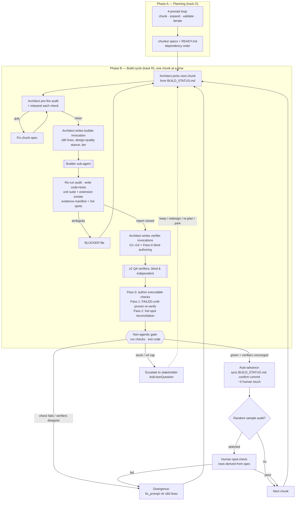
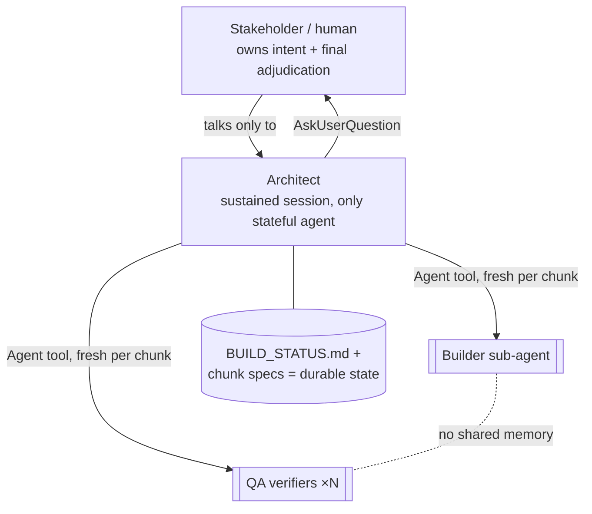

# MABP — Process Diagram

End-to-end flow of the Multi-Agent Build Process: Phase A (planning) → Phase B (build cycle) with the §16 autonomous acceptance gate. Source: [MULTI_AGENT_BUILD_PROCESS.md](MULTI_AGENT_BUILD_PROCESS.md).

> **Viewing:** open the markdown preview (VS Code: `Cmd+Shift+V`, or the preview icon top-right of the editor). The diagram renders inline.

## Session topology

