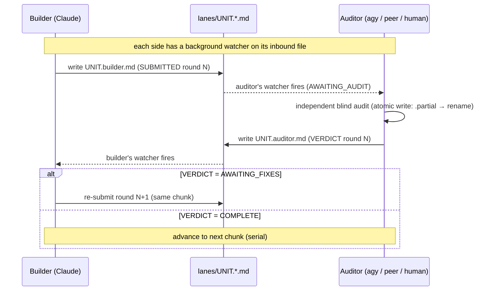
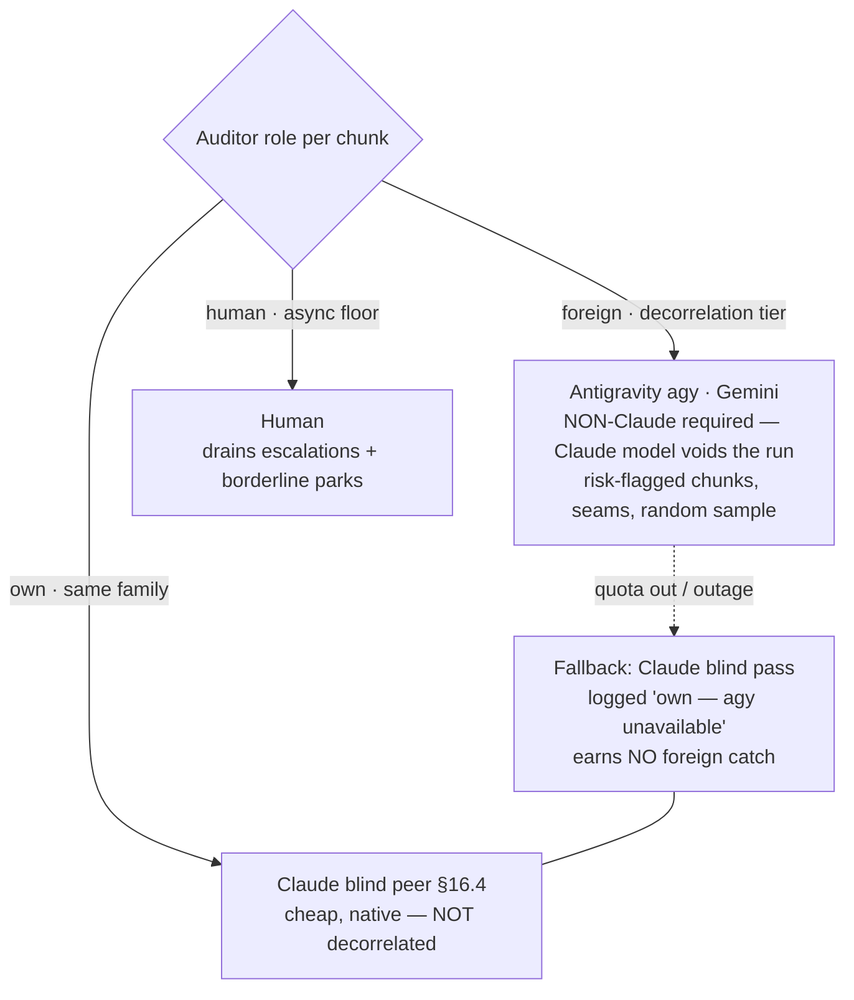
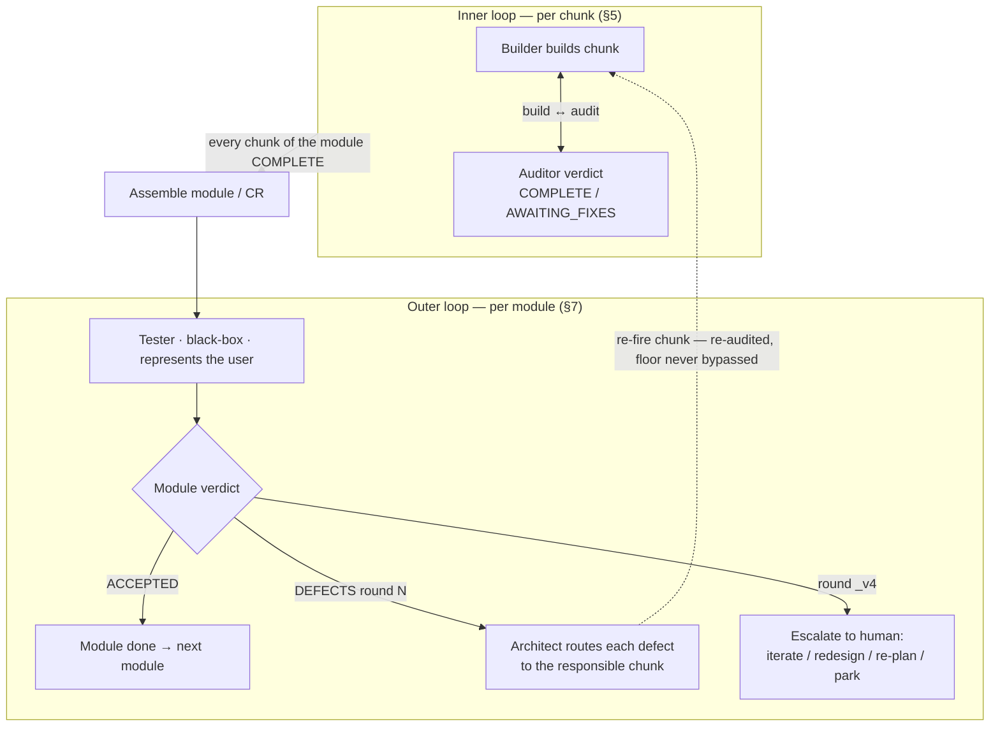
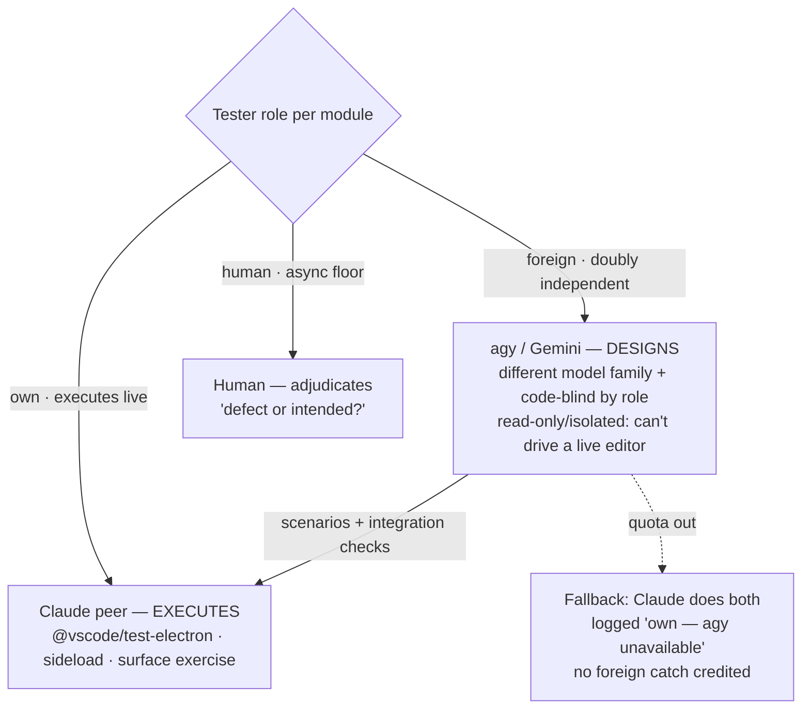

# MHBP — Process Diagram

Multi-**Harness** Build Process: a foreign harness — **Antigravity (`agy`, Gemini)** — bolted onto the unchanged MABP baseline as an adversarial, decorrelated auditor at three layers (Gate 1, the serial per-chunk loop, Gate 2), plus a black-box **Tester (Part III)** that exercises each completed module as the user and loops defects back to the builder. Source: [MHBP_LAB.md](MHBP_LAB.md).

> **Experimental / non-normative.** The production process ([MULTI_AGENT_BUILD_PROCESS.md](MULTI_AGENT_BUILD_PROCESS.md)) and `npm run gate` are the binding floor; the foreign audit is advisory signal layered on top.
>
> **Viewing:** open the markdown preview (VS Code: `Cmd+Shift+V`). The diagrams render inline.

## End-to-end: three layers around a serial build

```mermaid
flowchart TD
    PLAN[PLAN<br/>chunk specs + READY.md]

    PLAN --> G1

    subgraph G1box["GATE 1 — HARD SYNCHRONOUS barrier (Design → Build)"]
        G1[Auditor attacks the plan<br/>agy · Gemini 3.1 Pro High · read-only<br/>--add-dir docs/planning]
        G1 --> G1A{Blocking findings?}
        G1A -->|none| PASS1[Cleared]
        G1A -->|open + human present| HUM1[Human adjudicates ONCE<br/>revise / accept / dated rebuttal]
        G1A -->|open + no human| PARK1[Build PARKED<br/>never auto-passes]
        HUM1 -->|cleared| PASS1
    end

    PASS1 --> LOOP

    subgraph LOOP["PART II — SERIAL per-chunk loop (one chunk in flight)"]
        direction TB
        C0[Pick next chunk in dependency order] --> CB[Builder builds<br/>writes UNIT.builder.md · SUBMITTED round N]
        CB -->|auditor watcher fires| CA[Auditor audits independently<br/>blind adversarial pass · re-read source at file:line]
        CA --> CAW[writes UNIT.auditor.md · VERDICT + AUDITOR: own/foreign/human]
        CAW -->|builder watcher fires| CV{Verdict}
        CV -->|AWAITING_FIXES| CB
        CV -->|COMPLETE| C0
        CV -->|blocking / borderline| PARKC[Park chunk → escalation queue<br/>serial = parked chunk holds the line]
        PARKC -.human drains / fallback.-> C0
    end

    LOOP --> MOD{All chunks of<br/>the module COMPLETE?}
    MOD -->|no — keep building chunks| LOOP
    MOD -->|yes — assemble module| TEST

    subgraph TESTbox["PART III — per-module Tester (black-box · represents the USER)"]
        TEST[Tester drives EXPOSED SURFACES only<br/>never reads code to design a test] --> TMODE[exploratory user journeys + edge cases<br/>+ authored module-level integration checks]
        TMODE --> TV{VERDICT}
        TV -->|DEFECTS round N| TROUTE[Architect routes each defect<br/>to the responsible chunk]
        TV -->|_v4 cap| TESC[Escalate to human]
        TV -->|ACCEPTED| TDONE[Module done → next module]
    end

    TROUTE -.re-fire chunk through §5 build↔audit.-> LOOP
    TDONE --> G2

    subgraph G2box["GATE 2 — post-build whole-artifact audit (optional)"]
        G2[Auditor reads TOUCHED-FILES manifest<br/>built mechanically: git diff --name-only<br/>COMPLETENESS + ACCURACY · severity-tagged]
    end

    G2 --> ROUTE[Architect routes findings:<br/>fix-loop / dated rebuttal in BUILD_STATUS / escalate]

    GATE[(npm run gate<br/>non-agentic binding floor —<br/>no auditor ever edits or runs it)]
    GATE -.stays the machine floor under all of this.- LOOP
```

## The semaphore handshake (why Run-1 stalled)

State is **derived** from two files per chunk — no shared mutable flag. Each role runs a **mandatory background watcher** on its inbound file; skipping the watcher is what stalled Run-1.

Concrete mechanism: `docs/build/auditor/PROTOCOL.md` (portable kernel, DeliveryOS is the canonical
origin) + `DELIVERYOS_BINDINGS.md` (this project's resolution). Loop prompts: `ARCHITECT_LOOP_PROMPT.md`
/ `AUDITOR_LOOP_PROMPT.md`. Watcher: `watcher.sh`.

## Pluggable auditor — own / foreign / human

The chunk's auditor is a **role**; the `AUDITOR:` field records who ruled. Decorrelation comes from the **model family**, not from withholding context.

## Part III — the per-module Tester loop (the new outer loop)

The per-chunk build↔audit loop is the **inner** loop; the Tester wraps it in an **outer** module-level loop. The Tester is black-box (exposed surfaces only, represents the user) and feeds defects back to the builder via the architect. It is advisory — it never enters `npm run gate`.

### Pluggable Tester — design vs. execute

